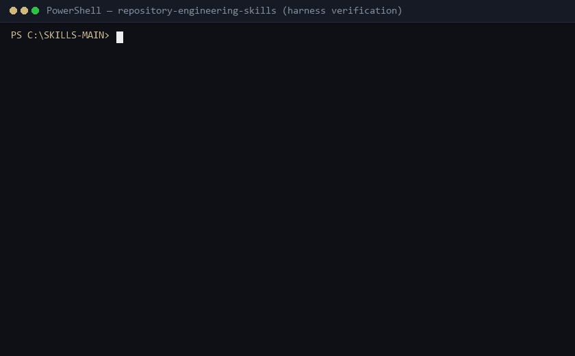

# Repository Engineering Skills: Code Review and Refactoring for AI Agents

   

I kept watching coding agents "improve" my code by swapping a declared `str` path for `pathlib.Path` — tests green, billing broken. So I wrote two skills to stop exactly that, plus the eval harness to check they do anything at all.

- **`repo-foundation`** — start modules, add features, migrate contracts, resume work without breaking public APIs.
- **`repo-native-refactor`** — read-only diff audits and small cleanups. No redesign, no scope creep.

> **Governing Principle:** Respect scope. Preserve contracts. Verify changes.

## 60-second try

```sh
mkdir skill-try && cd skill-try
npx skills@1.7.0 add Natchannnn/repository-engineering-skills --list
npx skills@1.7.0 add Natchannnn/repository-engineering-skills --skill repo-foundation repo-native-refactor --agent codex --copy -y
```

Then in a new session: `Use $repo-foundation to create a small Python CSV CLI with a test and README notes. Do not commit.` Then: `Use $repo-native-refactor to review the diff. Report only, do not edit.`



Rendered from real runs (`python scripts/render-demo-gif.py`). Full steps in `docs/demo/`.

These experiments cover a small set of tasks. They don't prove the skills win everywhere — see [What I got wrong](#what-i-got-wrong).

---

## What goes wrong without them

- **Contract drift:** return types or schemas change, callers break (`str` → `Path` is the classic).
- **Scope creep:** a narrow fix rewrites healthy unrelated modules.
- **Unchecked error paths:** partial states left on disk when operations fail.
- **Documentation drift:** `README.md` still describes last month's behavior.

---

## Choosing a skill

No skill needed for typos, comments, or single-script tweaks.

| Situation | Skill |
|---|---|
| New repo or module from scratch | `repo-foundation` |
| New feature or bugfix on a working codebase | `repo-foundation` |
| Changing a public contract or migrating schemas | `repo-foundation` |
| Resuming work across sessions | `repo-foundation` |
| Reviewing a diff without touching code | `repo-native-refactor` |
| Cleaning up duplication or dead code in a diff | `repo-native-refactor` |

---

## Installation

Requires Git + Node.js 22.20.0 or newer. Details in [docs/installation.md](docs/installation.md).

```sh
# preview, then install both for your agent (codex shown — swap --agent)
npx skills@1.7.0 add Natchannnn/repository-engineering-skills --list
npx skills@1.7.0 add Natchannnn/repository-engineering-skills --skill repo-foundation repo-native-refactor --agent codex --copy -y
```

Verified installs: `codex`, `claude-code`, `cursor`, `opencode`, `gemini-cli` (see [docs/npx-install-verification.md](docs/npx-install-verification.md)). Claude Code can also use this repo as a plugin marketplace via `.claude-plugin/marketplace.json`. Offline or no-Node setups: `scripts/install-skills.ps1` / `install-skills.sh`, or the runtime ZIP from `scripts/package-runtime.ps1`.

---

## Demos with independent verifiers

No LLM judges — a script decides pass/fail:

- **Contract-drift review** ([`examples/read-only-contract-review/`](examples/read-only-contract-review/)): agent audits a breaking diff read-only and files a structured finding. Verifier rejects negations, wrong symbols, and any worktree mutation.
- **Scoped feature dev** ([`examples/foundation-development/`](examples/foundation-development/)): agent adds an `export-json` command with tests + docs. Verifier checks both suites, JSON schema, and that nothing outside scope changed.

---

## Example prompts

```text
Use repo-foundation to add JSON export to this CLI tool.
Keep existing commands and error handling. Add tests and document the flag.
```

```text
Use repo-native-refactor to review the current diff against main.
Flag contract drift, unhandled error paths, or misplaced ownership.
Review only; do not edit files.
```

```text
Use repo-native-refactor to clean up this diff where a real maintenance or
correctness problem exists. Keep authorized behavior. Re-run affected checks.
```

---

## What I got wrong

- Gate 3 refactor variants scored *below* baseline — I refactored clean code without evidence. Fixed with the evidence gate.
- Pilot 1 README once claimed 9/9; evidence says 7/9 (2 strict-format fails, code was fine). Kept the fails.
- CP3 docs mentioned a CLI export that didn't exist yet. Noted, not hidden.
- My own red-team found the two skills disagreeing on tests-vs-convention. Fixed by adding the missing rank.
- Duelo with `superpowers` taught me my verification lacked reproduce-first + red-green. Stole it.

---

## Evidence (all of it, pass and fail)

| What | Result | Where |
|---|---|---|
| Pilot 1: 9 runs, 3 arms, deterministic verifiers | **7/9** (2 schema fails kept) | [PROTOCOL](pilots/small-behavioral-pilot/PROTOCOL.md) |
| Phase 2: 27 runs, triplets, rotated order | **27/27 = ceiling** — too easy to separate anyone, says so in the protocol | [PROTOCOL](pilots/phase2-contract-and-review/PROTOCOL.md) |
| Harness + demo suites | 59 + 41 tests green | `repo-*/evals/tests`, `scripts/test_demos.py` |
| Archive | 31 packets, SHA-256 parity | `evals-suite/` |
| Real-world runs | colorama regression test (has teeth), six correctly untouched, self-review with 2 fixes | [docs/realworld.md](docs/realworld.md) |
| Red-team + versus | 1 real divergence + 7 ambiguities → 9 patches; vs superpowers 1/2/3 with home advantage disclosed | [ATTACK_REPORT](adversarial/ATTACK_REPORT.md) |

Limits: toy fixtures + n=1 + single operator (me) almost everywhere; CP2/CP3 ablations n=1 with one judge; Windows-first (Linux via Docker); crash-durability against real power loss untested. Full analysis: [BENCHMARK_REPORT.md](BENCHMARK_REPORT.md).

---

## Verify it yourself

```sh
python -m pip install -r requirements-test.txt
python -B -m unittest discover -s repo-foundation/evals/tests      # 26 tests
python -B -m unittest discover -s repo-native-refactor/evals/tests  # 33 tests
python -B repo-foundation/evals/harness.py validate
python -B scripts/test_demos.py                                     # 41 tests
docker build -t reskills . && docker run --rm reskills              # linux reproduce
```

Pilot self-audits, archive checks, and installer/package tests: [docs/evaluation.md](docs/evaluation.md).

---

## Issues & license

Report issues with host, model, skill version, prompt, and what happened. See [CONTRIBUTING.md](CONTRIBUTING.md). [MIT License](LICENSE).
