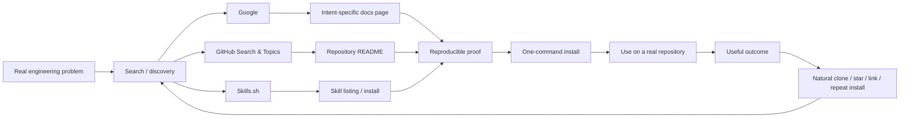
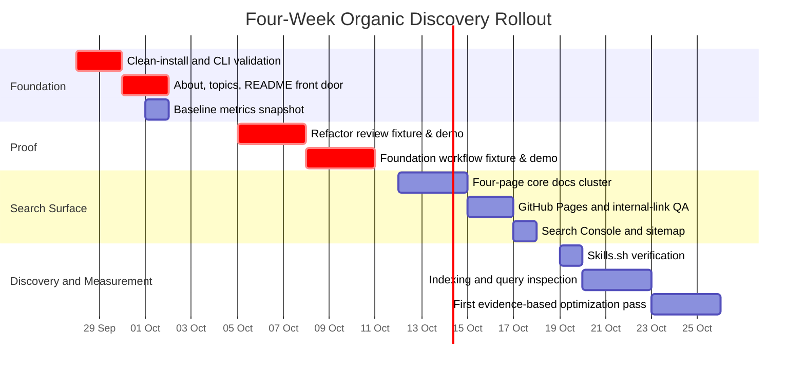

# Master Organic Discovery Plan for `repository-engineering-skills`

## Executive summary

The two Deep Research reports are substantially aligned. **Research A is the stronger execution blueprint; Research B is the stronger market and search-intelligence layer.** The correct merge is therefore not a compromise between two competing strategies. It is:

> **A's implementation system + B's market restraint and competitive positioning.**

Research A's central contribution is the multi-surface acquisition model—GitHub-native discovery, web search, skill-directory discovery, and potentially native AI ecosystem distribution—plus a concrete path from metadata through reproducible examples, GitHub Pages, Search Console, Skills.sh, and measurement. turn0file1 Research B independently reaches the same underlying conclusion but adds more useful competitive context: generic `code review` and `refactor` are crowded categories, while combinations such as **review-only + scoped + contract-aware + repository-native + verification** are more differentiated. turn0file2

Fresh research reinforces B's caution. On Skills.sh (observed September 2026), generic categories already contain substantial incumbents: [`safe-refactor`](https://www.skills.sh/juliusbrussee/caveman/safe-refactor) shows approximately 69.5K–70.9K installs, GitHub's `refactor` about 22K, `code-review-excellence` about 28.9K, and CodeRabbit's `code-review` about 12.7K. Skills.sh explicitly states its leaderboard is based on anonymous CLI installation telemetry, so these figures are ecosystem-discovery signals rather than active-user counts.

That leads to the primary strategic decision:

> **Do not try to win by being another "AI code review skill" or "safe refactor skill." Win by becoming the clearest, most reproducible answer to narrower engineering problems.**

The initial positioning should be:

> **Respect scope. Preserve contracts. Verify changes.**

The search-facing version should be more explicit:

> **Agent skills for read-only code review, scoped behavior-preserving refactoring, and repository development, backed by reproducible evaluation evidence.**

The project should remain **zero-paid, zero-forum-promotion, zero-social-promotion**. That does not mean zero distribution. Distribution comes through surfaces where the developer is already searching:



GitHub officially describes Topics as a mechanism for finding projects and solutions by subject, and repositories may have up to 20 topics; starting with eight tightly relevant topics is preferable to filling all 20. turn0search6 Google likewise recommends people-first, original, useful content rather than pages created primarily to capture search traffic, and its spam policies explicitly warn against scaled low-value content. turn1search1

The recommended master sequence is:

**P0 — make the product understandable and installable.**  
Clean-install verification → GitHub metadata → README front door → baseline metrics.

**P1 — prove what is different and create search surfaces.**  
Two reproducible examples → 6–8 substantive documentation pages → GitHub Pages → sitemap → Search Console.

**P2 — let observed demand drive optimization.**  
Skills.sh verification → weekly measurement → query-driven content improvement → only then add another example/page.

**P3 — controlled expansion.**  
AI-generated-code cleanup only with a real fixture; OpenAI plugin packaging only after the current publishing/discovery path is verified; custom domain only after the site demonstrates sustained search value; repo rename only if data eventually shows the present category name is actively harmful.

The four-week core implementation is approximately **36–42 maintainer hours**, excluding optional P3 work. Four weeks is not a sensible deadline for judging SEO success: Google says recrawling may take days to weeks and does not guarantee indexing. The first month should therefore be treated as **instrumentation + indexing + positioning validation**, not as a traffic-growth deadline. turn4search7

A final important caveat: the live public repository state could not be independently fetched reliably in this research session, so details such as its exact current About text, current Topics, current Pages status, and current Skills.sh listing are treated as **unspecified unless established by the supplied reports**. The master plan therefore emphasizes checks rather than pretending that unknown current state is known.

## Synthesis of Research A and Research B

### Comparison and resolution

| Area | Research A | Research B | Recommended resolution |
|---|---|---|---|
| **Primary strength** | Execution architecture: GitHub → Pages → Search Console → Skills.sh → ecosystem expansion. turn0file1 | Market intelligence: competition, registry SERPs, search terminology, category saturation. turn0file2 | **Use A as implementation spine; B as prioritization filter.** |
| **Core thesis** | Do not "SEO only the README"; build several acquisition surfaces. turn0file1 | Treat discovery as an ecosystem, not a single GitHub page. turn0file2 | Adopt **organic discovery engineering**, not conventional content marketing. |
| **Positioning** | Evidence-driven review, behavior-preserving refactoring, repository development. turn0file1 | Repository-native, scoped, review-only, contract-aware, verification-focused. turn0file2 | Brand principle: **Respect scope. Preserve contracts. Verify changes.** |
| **GitHub Topics** | Broader set, around 12 in the earlier proposal. turn0file1 | Eight-topic start. turn0file2 | **Use the user's original eight topics now.** Expand only when capability/content warrants it. |
| **Docs size** | Roughly 8–12 substantive pages. turn0file1 | Approximately eight tightly scoped URLs. turn0file2 | Start at **eight pages maximum**. Merge semantic variants into one strong page. |
| **GitHub Pages** | Early and strategically important for Search Console/control. turn0file1 | Also valuable, with particular emphasis on small, useful landing pages. turn0file2 | **P1**, after install UX and first proof assets are credible. |
| **Skills.sh** | Major high-intent discovery surface; installs are telemetry, not users. turn0file1 | Treat almost like a second search engine; verify CLI/listing independently. turn0file2 | **P2 but monitor from P0.** Never manipulate installs. |
| **Third-party registries** | Secondary to Skills.sh/native surfaces. turn0file1 | Registry SERPs may create additional organic entry points. turn0file2 | Passive indexing is welcome; one-time official submission is acceptable. **No directory spam.** |
| **OpenAI/plugin route** | Proposed as a potentially important native discovery surface. turn0file1 | Not central to the report. turn0file2 | **P3 experiment only.** OpenAI now documents packaging skills inside plugins, but a durable public-discovery route for this specific project remains **unspecified here** and must be verified before restructuring the repo. turn5search6 |
| **AI slop / vibe-code terms** | Attractive possible territory. turn0file1 | Crowded/trendy; use only when capability is genuinely demonstrated. turn0file2 | **Defer to P3.** No buzzword page until a fixture exists. |
| **Social preview** | Useful repository polish. turn0file1 | Low-value under a zero-social strategy. turn0file2 | Low priority. Do after search/onboarding fundamentals. |
| **Rename** | Keep existing repository name. turn0file1 | Keep existing repository name. turn0file2 | **Keep `repository-engineering-skills`.** |
| **Evidence discipline** | Benchmark limitations and reproducibility are differentiators. turn0file1 | Evidence is the strongest way to stand out from generic "safe" claims. turn0file2 | Make evidence a **brand constraint**, not merely a docs section. |

The original Astra analysis also correctly emphasized that the most important funnel is **understand → install → try → self-evaluate**, rather than maximizing keyword count. turn0file3 That principle survives the deeper research unchanged.

### Why narrower positioning matters

The live ecosystem makes a generic positioning increasingly difficult. Skills.sh currently surfaces multiple strong code-review offerings and several behavior-preserving refactoring skills; even very explicit terminology such as “behavior preserving,” “public interfaces,” “small changes,” and “verification” is no longer unusual. turn9search1turn9search5

Therefore the differentiator cannot merely be the adjective **safe**.

A more defensible combination is:

> **Review-only when asked to review. Scoped mutation when asked to refactor. Existing contracts treated as constraints. Verification treated as output.**

That is also easier to demonstrate. A developer can independently verify:

```text
review requested
→ no working-tree mutation

refactor requested
→ only named scope changed
→ pre-existing behavior tests still pass
→ public signatures remain stable
```

That is a much stronger conversion asset than a paragraph saying “safe AI refactoring.”

## Prioritized Master Plan

### Operating principles

Every task below has one owner by default: **Single maintainer**.

Estimated effort means focused implementation time, not calendar time. Search-engine waiting time is excluded.

Success metrics are deliberately split into two types:

**Acceptance metrics** are directly controllable: install succeeds, links work, tests pass, Pages builds.

**Outcome metrics** are observations: impressions, clicks, visitors, installations. They must not be converted into arbitrary promises.

GitHub Traffic only exposes full clones and visitors for the previous 14 days, and its “referring sites” view explicitly excludes search engines and GitHub itself. Therefore GitHub Traffic cannot answer “how many visitors came from Google”; Search Console must handle the search side of measurement. turn0search0

### Priority zero — correctness and front-door clarity

| Task | Concrete steps | Owner | Effort | Success metric | Dependencies |
|---|---|---:|---:|---|---|
| **P0-A Clean-install verification** | Run `npx skills add ... --list`; install each skill separately in a disposable environment; verify expected files; invoke once; test update/remove path; record CLI/Node/OS versions. | Maintainer | 3 h | Both skills discoverable and installable from a clean environment; no undocumented manual fix. | None |
| **P0-B GitHub metadata** | Keep repo name; update About; add exact eight initial topics; leave Website blank until Pages works. | Maintainer | 0.75 h | Correct About + eight Topics visible. | P0-A strongly preferred |
| **P0-C README front door** | Replace abstract opening with job-to-be-done pitch; put install above long methodology; add one 30-second example; link proof/evaluation. | Maintainer | 2.5 h | New visitor can identify purpose, skill choice, installation, and first task from first screen/minute. | P0-A |
| **P0-D Measurement baseline** | Save GitHub 14-day traffic snapshot; create weekly metrics CSV; record current date/commit; record current Skills.sh listing as present/absent/unverified. | Maintainer | 1 h | Baseline exists before discovery changes. | None |

**P0 total: approximately 7.25 hours.**

GitHub says Topics are explicitly intended to help people discover repositories and solutions in a subject area. turn0search6 Skills.sh documents both `npx skills add` and anonymous installation telemetry; a specific skill can be selected using the CLI's skill-selection mechanism, but the exact command for this repo must still pass P0-A before being advertised as canonical. turn0search1

### Priority one — reproducible proof and search infrastructure

| Task | Concrete steps | Owner | Effort | Success metric | Dependencies |
|---|---|---:|---:|---|---|
| **P1-A Refactor review fixture & demo** | Build tiny repository fixture with committed contract drift; establish pre-run baseline; enforce multi-layer no-mutation check (HEAD, index, working tree, SHA-256 tree manifest). | Maintainer | 5 h | Correct contract/caller finding; no mutation; repeatable instructions. | P0-A, P0-C |
| **P1-B Foundation development fixture & demo** | Build small repository setup and contract-evolution fixture with explicit acceptance criteria, verification scripts, and continuity checks. | Maintainer | 5 h | Verifiable contract evolution; documented boundaries; repeatable baseline. | P0-A |
| **P1-C Four-page core docs cluster** | Build Home & Skill Chooser, Installation Guide, Refactor Proof Demo, and Foundation Proof Demo; link to existing evaluation harness. | Maintainer | 6 h | Every page has a distinct user job and at least two useful internal links; user-facing only. | P1-A/B |
| **P1-D GitHub Pages** | Publish `/docs`; verify build; add page titles/descriptions where supported; test mobile and links; add sitemap. | Maintainer | 2 h | Pages site live with all intended URLs returning successfully. | P1-C |
| **P1-E Search Console** | Verify project site; submit sitemap; inspect key URLs; request indexing for home/core pages once. | Maintainer | 1 h | Property verified; sitemap accepted; indexing status observable. | P1-D |

**P1 total: approximately 23 hours.**

GitHub officially supports publishing GitHub Pages from a repository's `/docs` folder, and a project site normally lives at `owner.github.io/repositoryname`. turn1search2 Google notes that a new site with few external links is one situation where a sitemap can improve URL discovery, while also stressing that sitemap submission is only a hint and never an indexing or ranking guarantee. turn0search12

### Priority two — ecosystem discovery and data loop

| Task | Concrete steps | Owner | Effort | Success metric | Dependencies |
|---|---|---:|---:|---|---|
| **P2-A Skills.sh verification** | Search exact repository and exact skill names; compare listing metadata against source; run `--list`; investigate only if CLI and listing disagree. | Maintainer | 1 h | Listing status explicitly known; command shown there matches a working install path. | P0-A |
| **P2-B Weekly metrics routine** | Every seven days capture Search Console, GitHub Traffic, Skills.sh counts, release/commit changes, issues. | Maintainer | 1 h setup + 15 min/week | No 14-day GitHub data is lost; observations tied to specific changes. | P0-D, P1-E |
| **P2-C Query-led optimization** | Examine impressions/clicks by page/query; deepen pages with relevant impressions; test titles/opening where impressions exist but clicks lag; ignore irrelevant queries. | Maintainer | 4 h/month initially | At least one optimization decision is based on observed query data rather than a guessed keyword. | P1-E |
| **P2-D Topic guide expansion** | Only after evidence of specific search query demand, expand core 4 pages with dedicated deep guides (review-without-editing, behavior-preserving-refactoring, repository-development). | Maintainer | 4 h conditional | Distinct demand observed in Search Console; avoid thin or redundant pages. | P1-C, query/user signal |

Skills.sh says skills enter its leaderboard automatically through anonymous CLI install telemetry and that telemetry can be disabled. This makes Skills.sh useful as an installation-discovery signal, but it should **not** be interpreted as active users or real-world success. turn0search1

### Priority three — conditional expansion

| Task | Trigger | Owner | Effort | Success metric | Dependencies |
|---|---|---:|---:|---|---|
| **P3-A AI-generated-code cleanup** | Search Console repeatedly surfaces relevant AI-code-cleanup intent **and** a legitimate fixture can be built. | Maintainer | 6–8 h | Dedicated case has real input, verification and limitations; no trend-bait claims. | P2-C |
| **P3-B OpenAI plugin packaging experiment** | Current official packaging/distribution documentation is verified and the additional discovery value justifies maintenance. | Maintainer | 4–6 h | Prototype package passes official validation without duplicating sources of truth. | Stable P1/P2 |
| **P3-C Custom domain** | GitHub Pages gets sustained search use or project branding/analytics require independence. | Maintainer | 2–4 h | Migration completed without broken URLs/indexing regressions. | Stable Pages |
| **P3-D Rename reassessment** | Only if substantial query/user evidence shows the repository name is actively confusing discovery. | Maintainer | 1 h analysis; migration much larger | Evidence-backed decision, not keyword preference. | Months of data |

OpenAI's current developer documentation confirms that skills can be packaged inside plugins alongside MCP configuration or by themselves as package components. That validates a **packaging experiment**; this report does **not** assume an unspecified public-directory placement mechanism or guaranteed discoverability. turn5search6

## Search strategy and content architecture

### Candidate query map

These are **search hypotheses, not search-volume claims**. Neither report had Keyword Planner, Ahrefs, Semrush, or Search Console data for the project, so no honest conclusion can currently be made about monthly volume or keyword difficulty. Research A proposed a broad query set, while Research B correctly argued that the set should function as a validation queue rather than a content-generation queue. turn0file1 turn0file2

Google recommends creating useful pages for people rather than producing many search-first pages, and its spam policy specifically addresses scaled low-value content. One substantial page should therefore cover several semantically related queries. turn1search1

#### Review without unsolicited edits

**Target:** `/guides/review-without-editing/`  
**Proof destination:** `/examples/read-only-contract-review/`

1. `code review without editing code`
2. `review git diff without modifying files`
3. `read only code review agent`
4. `AI review code without changes`
5. `AI code review without rewriting`
6. `review code changes only no edits`
7. `review pull request without modifying code`
8. `AI agent review only mode`

This is the strongest initial cluster because the outcome is deterministic enough to prove: a review request should not create working-tree changes.

#### Codex and agent code review

**Target:** `/guides/review-without-editing/`

9. `codex code review skill`
10. `codex review skill`
11. `codex PR review skill`
12. `review git diff with codex`
13. `AI agent code review skill`
14. `agent code review skill`
15. `code review SKILL.md`

Generic code-review intent is competitive, so these should be supported by the page but not treated as the only positioning. Current Skills.sh results include established review skills with substantial install telemetry, reinforcing the need for a narrower differentiator. turn6search6turn6search11

#### Behavior-preserving and scoped refactoring

**Target:** `/guides/behavior-preserving-refactoring/`  
**Proof destination:** `/examples/scoped-refactor/`

16. `behavior preserving refactoring agent`
17. `refactor code preserve public API`
18. `safe refactoring AI agent`
19. `scoped refactoring agent`
20. `refactor without scope creep`
21. `refactor only changed files`
22. `repository native refactoring`
23. `AI refactor without behavior changes`

This cluster is also competitive. Existing skills already use “behavior preserving,” “safe,” and “preserve public interfaces” vocabulary. The page therefore needs experimental proof rather than more adjectives. turn9search2turn9search12

#### Repository development and Foundation

**Target:** `/guides/repository-development/`

24. `repository development skill AI agent`
25. `codex repository development skill`
26. `AI coding repository workflow`
27. `repository engineering AI agents`
28. `AI coding repository conventions`
29. `make repository agent ready`
30. `multi session repository development`

The broader ecosystem is increasingly talking about repository harnesses, boundaries, validation, and agent-ready engineering environments, so this terminology should be monitored rather than assumed. Current examples include GitHub's `harness-engineering` skill and newer repository-harness projects. turn6search13

#### Installation and ecosystem intent

**Target:** `/installation/`

31. `install codex skills`
32. `install agent skills`
33. `npx skills add codex`
34. `npx skills add specific skill`
35. `skills.sh code review`
36. `skills.sh refactoring`

The Skills CLI is already a defined ecosystem entry point, and Skills.sh explicitly presents browsing and CLI installation as its core discovery/install flow. turn0search3

#### Evidence and evaluation

**Target:** `/evidence/evaluation-methodology/`

37. `agent skill evaluation`
38. `AI coding skill benchmark`
39. `evaluate agent skills`
40. `reproducible agent skill test`

These may be lower-volume terms, but they support the project's strongest trust asset: explicit evidence and limitations.

#### AI-generated-code cleanup — deferred

**Initial target:** a subsection of `/guides/behavior-preserving-refactoring/`; **no standalone page yet**.

41. `clean up AI generated code`
42. `AI generated code cleanup`
43. `vibe coded repository cleanup`
44. `remove AI code smells`
45. `AI code slop cleanup`

Do not create a separate landing page until the project has a real fixture and Search Console or direct user behavior shows this problem belongs to the product. Google explicitly warns against writing on topics merely because they are trending or expected to attract search traffic. turn1search1

### Recommended GitHub metadata

**Repository name**

```text
repository-engineering-skills
```

**Decision: keep.**

There is no evidence strong enough to justify migration cost. A rename should not be used as an SEO hack.

**About description**

```text
Agent skills for read-only code review, scoped behavior-preserving refactoring, and repository development, backed by reproducible evaluation evidence.
```

**Initial Topics — use the user's original eight exactly**

```text
agent-skills
codex
code-review
refactoring
ai-coding
developer-tools
software-engineering
testing
```

Eight is a deliberate start, not a technical limit; GitHub permits up to 20 topics and recommends topics that represent the repository's actual purpose and subject area. turn0search6

**Website**

Leave unspecified until Pages is live. Then use:

```text
https://natchannnn.github.io/repository-engineering-skills/
```

GitHub documents that project Pages sites use the `owner.github.io/repositoryname` pattern by default. turn1search7

### Documentation architecture

The documentation cluster should start with **four core pages** (Home, Installation, one Refactor proof demo, and one Foundation proof demo) to ensure both skills have immediate, independently testable evidence without unnecessary authoring overhead. It can expand up to **eight substantive URLs** as demand dictates, with each URL corresponding to a genuine engineering job rather than a keyword permutation:

| Page | Suggested H1 / major headings | Primary internal links |
|---|---|---|
| **`/`** | `Repository Engineering Skills for AI Coding Agents` → `Review without rewriting` → `Refactor without contract drift` → `Develop with repository context` → `Choose a skill` → `Reproducible evidence` | Installation, both guides, both examples, evaluation |
| **`/installation/`** | `Install Repository Engineering Skills` → `List available skills` → `Install one skill` → `Verify installation` → `Update/remove` → `Troubleshooting` | Home, both skill guides, examples |
| **`/guides/review-without-editing/`** | `Review a Git Diff Without Editing Code` → `What review-only means` → `Define the diff boundary` → `Actionable findings` → `Prove no files changed` → `When review should stop` | Read-only example, install, evaluation, refactor guide |
| **`/guides/behavior-preserving-refactoring/`** | `Behavior-Preserving Refactoring with AI Agents` → `Define behavior boundary` → `Preserve public contracts` → `Bound the scope` → `Run the same proof before and after` → `When not to refactor` | Scoped example, install, evaluation |
| **`/guides/repository-development/`** | `Repository Development with AI Agents` → `Read repository contracts first` → `Define scope and acceptance criteria` → `Implementation` → `Verification` → `Documentation continuity` | Installation, evaluation, home |
| **`/examples/read-only-contract-review/`** | `Reproducible Read-Only Contract Drift Review` → `Fixture` → `Baseline` → `Prompt` → `Expected findings` → `No-mutation verification` → `Limitations` | Review guide, evaluation, install |
| **`/examples/scoped-refactor/`** | `Reproducible Scoped Refactoring Example` → `Fixture` → `Baseline tests` → `Scope contract` → `Prompt` → `Changed files` → `Post-refactor verification` → `Limitations` | Refactor guide, evaluation, install |
| **`/evidence/evaluation-methodology/`** | `Evaluation Methodology` → `What is measured` → `Task fixtures` → `Environment metadata` → `Acceptance criteria` → `Archived results` → `What the results do not prove` | Both examples, home |

Google says every important page should be linked from at least one other page and recommends descriptive anchor text rather than generic wording such as “click here.” turn4search1

For example:

```markdown
See the [reproducible read-only contract review](../examples/read-only-contract-review/)
```

is preferable to:

```markdown
See [this example](...)
```

The README and Pages home should be hubs, while each guide links to its matching example and evaluation methodology.

### Technical search configuration

GitHub Pages can publish directly from `main:/docs`, which keeps documentation close to the repository and avoids a second content-management system. turn1search2

A minimal setup is sufficient:

```text
docs/
├── index.md
├── installation.md
├── guides/
│   ├── review-without-editing.md
│   ├── behavior-preserving-refactoring.md
│   └── repository-development.md
├── examples/
│   ├── read-only-contract-review.md
│   └── scoped-refactor.md
├── evidence/
│   └── evaluation-methodology.md
└── _config.yml
```

Do **not** duplicate the full text of every guide inside the README. README should summarize and route; Pages should answer deeper search intent.

A sitemap is reasonable despite the site's small size because zero-promotion means few initial external links. Google says new sites with few external links are one category that may benefit from sitemaps, while stressing that internal linking alone can be enough for small, comprehensively linked sites. turn0search12

No special “AI SEO” infrastructure is needed. Google's current guidance states that AI Overviews and AI Mode do not require extra machine-readable AI files or special schema beyond normal Search fundamentals; pages must simply be indexed and eligible for normal Search snippets. turn1search0

## Search-first repository UX and reproducible proof

### README opening draft

The first screen should answer four questions:

**What is this?**  
**Which skill do I need?**  
**How do I install it?**  
**Can I verify its behavior quickly?**

A recommended opening:

```markdown
# Repository Engineering Skills for AI Coding Agents

**Review without rewriting. Refactor without contract drift. Build without losing repository context.**

Two reusable agent skills for working safely inside real software repositories:

- **repo-native-refactor** — review changes without unsolicited edits, or perform scoped
  behavior-preserving refactoring while respecting existing contracts and repository conventions.
- **repo-foundation** — guide repository setup, feature development, contract evolution,
  verification, documentation updates, and continuity across sessions.

## Install

Install one skill with the Skills CLI:

```bash
npx skills add Natchannnn/repository-engineering-skills --skill repo-native-refactor
npx skills add Natchannnn/repository-engineering-skills --skill repo-foundation
```

## Try a review-only task

Record the clean baseline commit, then ask for a review-only pass:

```bash
INITIAL_HEAD=$(git rev-parse HEAD)
```

Prompt:

```text
Use repo-native-refactor to review the current branch against main.

Identify concrete contract drift, affected callers, and missing verification.
Review only. Do not edit files.
```

Then verify that HEAD did not move, index is clean, and working tree is unmodified:

```bash
test "$(git rev-parse HEAD)" = "$INITIAL_HEAD"
git status --porcelain
git diff --quiet HEAD
git diff --cached --quiet
```

See the [reproducible review example](docs/examples/read-only-contract-review.md)
and [evaluation methodology](docs/evidence/evaluation-methodology.md).

The included evaluations cover explicit fixtures and task domains.
They are evidence about those conditions, not universal performance claims.
```

The two installation commands should be published only after P0-A verifies them against the current CLI. Skills.sh's current ecosystem does expose skill-specific installation commands of this form, while its official CLI documentation confirms `npx skills add` as the primary installation mechanism. turn6search1

Google primarily generates snippets from visible page content and only sometimes uses the supplied meta description, so the README/Pages opening itself should be clear rather than treating metadata as a substitute for good copy. turn4search0

### Reproducible example specification: read-only contract review

This should be the flagship example because its most important property—**no unsolicited edits**—can be verified mechanically.

| Component | Specification |
|---|---|
| **Fixture** | Tiny Python repository with a `main` baseline and a committed `review-case` branch. The branch changes the return shape/type of a public function while leaving a dependent caller inconsistent. |
| **Initial state** | Working tree clean. The problematic change is committed so the agent can review `main...HEAD` without needing unstaged files. |
| **Skill** | `repo-native-refactor` |
| **Host/model** | **Unspecified.** Each archived run must record host, model identifier/version if available, date, and skill commit SHA. |
| **Expected job** | Identify contract drift, identify an affected caller, explain impact, suggest missing verification, and **do not modify files**. |
| **Failure** | Any file mutation; generic advice without identifying the concrete drift/caller; invented bug not supported by fixture. |

Setup:

```bash
# 1. Bootstrap fixture repository
python examples/read-only-contract-review/bootstrap.py /tmp/read-only-contract-review
cd /tmp/read-only-contract-review

# 2. Install skill inside target project fixture so the host agent discovers it
npx skills add Natchannnn/repository-engineering-skills --skill repo-native-refactor

# 3. Run baseline verification FIRST so test caches / bytecode exist before snapshotting
python -m pytest -q
git status --porcelain

# 4. Capture baseline commit and cryptographic file inventory outside the mutable repository
INITIAL_HEAD=$(git rev-parse HEAD)
python -c "import hashlib, pathlib, json; ignored_parts = {'.git', '.agents', '__pycache__', '.pytest_cache'}; manifest = {p.as_posix(): hashlib.sha256(p.read_bytes()).hexdigest() for p in pathlib.Path('.').rglob('*') if p.is_file() and not any(part in ignored_parts for part in p.parts)}; pathlib.Path('/tmp/read-only-baseline-manifest.json').write_text(json.dumps(manifest, indent=2))"

git log --oneline --decorate -3
git diff main...HEAD
```

Prompt:

```text
Use repo-native-refactor to review the current branch against main.

Focus on concrete correctness and contract problems introduced by the branch.
Identify affected callers and missing verification.

Review only. Do not modify files.
```

Expected output shape:

```text
Finding: Public return contract changed
Location: src/profile.py:<line>
Affected caller: src/billing.py:<line>
Impact: <specific failure or incompatibility>
Evidence: <why the diff demonstrates the problem>
Suggested verification: <specific test or check>
```

Post-run verification:

```bash
# 1. Verify HEAD has not advanced (no unsolicited commits)
test "$(git rev-parse HEAD)" = "$INITIAL_HEAD"

# 2. Verify working tree and index are clean
git status --porcelain
git diff --quiet HEAD
git diff --cached --quiet

# 3. Verify byte-exact integrity of protected repository files against external baseline
python -c "import hashlib, pathlib, json, sys; expected = json.loads(pathlib.Path('/tmp/read-only-baseline-manifest.json').read_text()); ignored_parts = {'.git', '.agents', '__pycache__', '.pytest_cache'}; current = {p.as_posix(): hashlib.sha256(p.read_bytes()).hexdigest() for p in pathlib.Path('.').rglob('*') if p.is_file() and not any(part in ignored_parts for part in p.parts)}; mismatch = [k for k, v in expected.items() if current.get(k) != v] + [k for k in current if k not in expected]; sys.exit(1 if mismatch else 0)"
```

Acceptance criteria:

| Check | Pass condition |
|---|---|
| Contract finding | Correct changed public contract identified |
| Caller impact | At least one known affected caller identified |
| Evidence | Finding references concrete repository locations |
| Unsolicited commit | `git rev-parse HEAD` strictly matches `$INITIAL_HEAD` |
| Working tree & index | `git status --porcelain`, `git diff --quiet HEAD`, and `git diff --cached --quiet` all clean |
| Cryptographic integrity | All protected repository files match `baseline_manifest.json` byte-for-byte with zero unmanaged additions |
| Claim scope | Output does not claim universal detection capability |

This provides multi-layer protection against false negatives: checking `INITIAL_HEAD` detects unsolicited commits; checking index detects staged changes; and comparing the SHA-256 tree manifest detects modifications to ignored files or subtle filesystem mutations.

### Reproducible example specification: scoped behavior-preserving refactor

| Component | Specification |
|---|---|
| **Fixture** | Small payment-processing module containing duplicated private validation logic and one unnecessary internal wrapper. |
| **Public contract** | Three public functions with signatures and output/error behavior locked by tests. |
| **Allowed scope** | `src/payment_processor.py` only. |
| **Skill** | `repo-native-refactor` |
| **Host/model** | **Unspecified.** Record it in every archived run. |
| **Expected job** | Reduce duplication/internal complexity without altering public signatures, externally visible behavior, or unrelated files. |
| **Failure** | Tests fail; public signature changes; additional paths modified; new dependency added without necessity. |

Baseline:

```bash
python examples/scoped-refactor/bootstrap.py /tmp/scoped-refactor
cd /tmp/scoped-refactor

python -m pytest -q
python verify_public_contract.py
git status --porcelain
```

Prompt:

```text
Use repo-native-refactor to simplify the duplicated validation logic in
src/payment_processor.py.

Requirements:
- preserve all public function signatures
- preserve existing behavior and error behavior
- do not modify files outside src/payment_processor.py
- do not add dependencies
- run the relevant verification after the refactor
```

Post-run:

```bash
python -m pytest -q
python verify_public_contract.py
git diff --name-only HEAD
```

Acceptance criteria:

```text
✓ baseline tests pass before the change
✓ the same behavior tests pass afterward
✓ public contract verification passes
✓ changed-file set is exactly the allowed scope
✓ no dependency/configuration changes
✓ output states what changed and what was intentionally preserved
```

Every proof page should publish a small machine-readable run record such as:

```json
{
  "date": "2026-10-08",
  "skill": "repo-native-refactor",
  "skill_commit": "<sha>",
  "host": "<record-at-run-time>",
  "model": "<record-at-run-time-or-unknown>",
  "fixture_commit": "<sha>",
  "prompt_file": "prompt.txt",
  "baseline_command": "python -m pytest -q",
  "verification_command": "python verify_public_contract.py",
  "result": "pass",
  "limitations": [
    "single fixture",
    "single repository shape",
    "not evidence of universal superiority"
  ]
}
```

That evidence-first approach directly supports Google's people-first guidance, which asks whether content offers original research/analysis, demonstrates first-hand experience, and explains how results were produced. turn1search1

## Four-week rollout and measurement

### Timeline

The dates below assume work begins Monday, **September 28, 2026**, in the user's Asia/Ho_Chi_Minh time zone.



### Weekly milestones

| Week | Milestone | Deliverables | What is measured |
|---|---|---|---|
| **Sep 28–Oct 4** | **Repository is understandable and installable** | Clean install; About; eight Topics; README opening; baseline data | GitHub visitors/clones baseline; CLI success; Skills.sh status recorded as verified/unverified |
| **Oct 5–11** | **Differentiation becomes independently testable** | Review-only fixture; scoped-refactor fixture; archived run format | Pass/fail acceptance checks; install friction; fixture reproducibility |
| **Oct 12–18** | **Search property becomes live** | Four-page core docs cluster; GitHub Pages; sitemap; Search Console | Index coverage, sitemap status, first impressions if any |
| **Oct 19–25** | **Feedback loop starts** | Skills.sh check; weekly dashboard; first query-based edits | Queries, pages, impressions, clicks, GitHub traffic, Skills.sh installs |

### Search Console measurement

Search Console's Performance reporting exposes organic Search performance broken down by queries and pages, including impressions and clicks. turn4search2

Record weekly:

```text
indexed_pages
search_impressions
search_clicks
search_ctr
top_queries
top_pages
query/page pairs
average_position (diagnostic only)
```

Do not obsess over average position. Google's own troubleshooting guidance says impressions and clicks are ultimately more important than focusing excessively on absolute rank. turn4search11

A useful detail for this GitHub Pages setup: Google's branded/non-branded query filter is only available for eligible top-level properties, not URL-path properties, and it also requires sufficient volume. A project Pages property such as:

```text
https://natchannnn.github.io/repository-engineering-skills/
```

should therefore **not be assumed to receive the branded-query filter**. Group branded terms manually at first—for example `repo-native-refactor`, `repo-foundation`, and the repository name—versus non-branded problem queries. turn4search4

### GitHub Traffic measurement

Snapshot every week because GitHub's repository Traffic graph only provides visitor/full-clone data for the previous 14 days. turn0search0

Record:

```text
unique_visitors
unique_cloners
full_clones
popular_content
external_referrers
```

Do **not** label GitHub's external-referrer count “organic search.” GitHub explicitly excludes search engines and GitHub itself from that referral section. turn0search0

Therefore:

```text
Search Console = Google discovery
GitHub Traffic = repository interest
Skills.sh = CLI ecosystem installation signal
```

They should be interpreted together, not merged into one fake conversion metric.

### Skills.sh measurement

Record:

```text
listing_exists
repo_install_count
repo-native-refactor_install_count if exposed
repo-foundation_install_count if exposed
listing_metadata_correct
CLI --list result
```

Skills.sh says its leaderboard is driven by anonymous install telemetry. The number should therefore be labeled **CLI installs**, never “users,” “active users,” or “market share.” turn0search1

The current ecosystem also demonstrates that listings and install commands deserve direct verification rather than blind trust; the plan should treat CLI discoverability and directory discoverability as separate checks.

### Weekly snapshot schema

```csv
week_start,repo_commit,pages_live,pages_indexed,search_impressions,search_clicks,search_ctr,top_nonbranded_query,top_landing_page,github_unique_visitors,github_unique_cloners,github_full_clones,skills_sh_listing_status,skills_sh_total_installs,external_issues,notes
```

Use `N/A`, not `0`, for unavailable data.

### Decision rules

The first month should produce decisions, not traffic targets.

| Observation | Response |
|---|---|
| Page not indexed after reasonable crawl time | Inspect Pages deployment, crawlability, links, sitemap and URL Inspection |
| Indexed but no impressions | Do not rewrite CTA yet; question demand/relevance and wait for more data |
| Relevant impressions begin appearing | Deepen the existing page before creating a new one |
| Meaningful impressions but very low CTR | Test title/H1/opening and page-description clarity |
| Search clicks rise but install questions/failures appear | Stop writing content; fix onboarding/install first |
| A long-tail cluster emerges unexpectedly | Add a section or example to the closest existing page |
| A proposed keyword has no product evidence | Do not target it |
| Generic `refactor` remains invisible while `review without editing` earns impressions | Follow observed niche demand rather than forcing the larger keyword |
| Skills.sh listing stale but CLI works | Investigate distribution/indexing separately from product SEO |
| Stars rise without clicks/install/use evidence | Treat as a secondary signal, not proof of adoption |

Google warns that recrawling may take days to weeks and that requesting recrawl repeatedly does not make crawling faster. turn4search7

## Risks, hypotheses, experiments, and immediate actions

### Risks and hypotheses to validate

| Hypothesis / risk | Current status | Experiment | Decision criterion |
|---|---|---|---|
| **Review-only has meaningful search demand** | Hypothesis from A/B | Publish guide + proof; observe Search Console for 6–8 weeks | Relevant non-branded impressions emerge |
| **Contract-preserving scoped refactor differentiates enough** | Plausible, but competitive | Publish reproducible fixture; monitor queries and install feedback | Long-tail queries or user feedback reference scope/contracts |
| **GitHub Pages adds discovery beyond GitHub repo page** | Plausible | Track Pages query/page impressions and GitHub traffic concurrently | Pages earn independent non-branded impressions/clicks |
| **Eight Topics improve GitHub-native discoverability** | Reasonable but hard to attribute | Add once; avoid constant churn | Repository appears for relevant topic/search queries; no direct causal claim |
| **Skills.sh will list both skills correctly** | **Unspecified** | Run CLI `--list`; search exact repo and skill names weekly | CLI + directory agree |
| **One-command installation is stable** | Must be proven | Clean environment test; repeat after CLI/repo structural changes | No manual recovery required |
| **Evidence improves trust/conversion** | Strategic inference | Put proof before benchmark claims; monitor issues/clones/install behavior | Users reach install without needing clarification about safety claims |
| **AI-code-cleanup deserves a dedicated page** | Not yet established | Monitor relevant queries; build fixture only if demand + capability exist | Both evidence and demand present |
| **OpenAI plugin packaging creates worthwhile discovery** | Packaging supported; discovery value unspecified | P3 branch experiment only | Official publishing/discovery path verified and maintenance cost justified |
| **No proactive promotion will still compound** | Long-term hypothesis | Run 8–12 weeks with Search/Skills surfaces | Non-branded impressions, unknown-user installs or external issues begin appearing |

Google's guidance is particularly aligned with the project's evidence-first philosophy: helpful pages should provide original information or analysis, demonstrate first-hand knowledge, and leave readers able to accomplish their goal. turn1search1

### Explicit non-goals

The merged plan should formally reject the following:

**No forum or social-media launch campaign.** This is a user constraint, not a temporary omission.

**No paid promotion.**

**No fake Skills.sh installs.** Skills.sh uses install telemetry for leaderboard discovery, so manipulating it would corrupt the very signal being used to evaluate organic adoption. turn0search1

**No 20-topic keyword dump.**

**No page-per-keyword content farm.** Google's spam policy defines scaled content abuse around large volumes of low-value content created primarily to manipulate search ranking. turn0search4

**No `llms.txt` or “AI SEO” work as a priority.** Google says AI Search features require no special AI-specific file or schema beyond normal Search eligibility and fundamentals. turn1search0

**No repo rename in the initial plan.**

**No benchmark claim broader than the tested task, model, fixture, and revision.**

**No custom domain before there is a concrete reason for one.**

### Immediate actions for the next 48 hours

These are deliberately biased toward actions that unlock everything downstream rather than toward writing more SEO content.

| Order | Immediate action | Time |
|---:|---|---:|
| **1** | Run `npx skills add Natchannnn/repository-engineering-skills --list` from a clean directory and save the exact output/version information. | 20 min |
| **2** | Clean-install `repo-native-refactor` and `repo-foundation` separately; document anything that differs from the README. | 60–90 min |
| **3** | Freeze one canonical positioning sentence: **“Respect scope. Preserve contracts. Verify changes.”** plus the search-facing About description above. | 15 min |
| **4** | Keep the repository name and set the exact eight Topics: `agent-skills`, `codex`, `code-review`, `refactoring`, `ai-coding`, `developer-tools`, `software-engineering`, `testing`. | 15 min |
| **5** | Replace the README opening with the 10-second pitch + install commands + 30-second review example; retain the existing deeper methodology below it. | 60–90 min |
| **6** | Capture the first GitHub Traffic baseline and create `tracking/weekly_metrics.csv`; mark unavailable fields `N/A`. | 20 min |
| **7** | Create the four-page `/docs` skeleton (Home, Installation, Refactor Demo, Foundation Demo) with user-facing files only, excluding internal review/planning docs. | 45 min |
| **8** | Scaffold `examples/read-only-contract-review/` with a base commit/change commit model and automated clean-worktree verification. | 90 min |
| **9** | Scaffold `examples/foundation-development/` with contract boundary checks, verification scripts, and documentation continuity. | 90 min |
| **10** | Create one evidence-run template containing skill commit, fixture commit, host/model, prompt, commands, exit codes, result and limitations; require every future demo to use it. | 30 min |

The next 48 hours therefore do **not** require publishing eight articles, buying a domain, submitting to directories, chasing backlinks, or advertising anywhere.

They produce something much more valuable:

```text
clear purpose
    ↓
verified installation
    ↓
credible README
    ↓
explicit search architecture
    ↓
two mechanically testable differentiators
    ↓
measurement baseline
```

After that, the four-week plan creates the search surfaces needed for compounding organic discovery.

The governing rule for the entire strategy should remain:

> **Do not manufacture attention. Manufacture usefulness, proof, and discoverability.**

GitHub Topics make the project classifiable and discoverable inside GitHub. turn0search6 GitHub Pages gives the project a controllable project site and can publish directly from `/docs`. turn1search2 Search Console turns guessed keywords into observed queries, pages, impressions and clicks. turn4search2 Skills.sh creates a high-intent installation surface driven by real CLI installation telemetry. turn0search1 And Google's own guidance favors exactly the asset the repository is best positioned to create: original, first-hand, useful material whose claims can be understood and independently evaluated. turn1search1

That combination gives `repository-engineering-skills` a realistic organic path without requiring the maintainer to become a social-media promoter: **become the best documented and best evidenced answer to a deliberately narrow set of repository-engineering problems, then let GitHub, Search, and the skill ecosystem do the discovery work.**